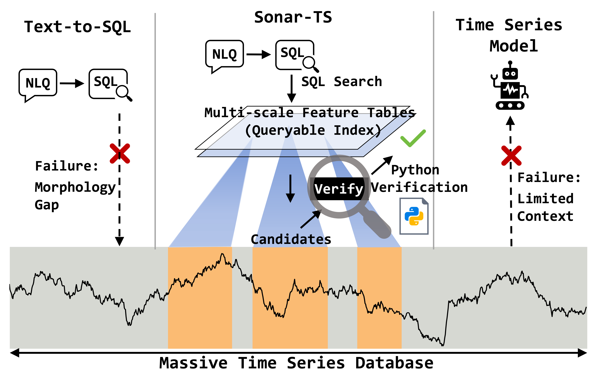
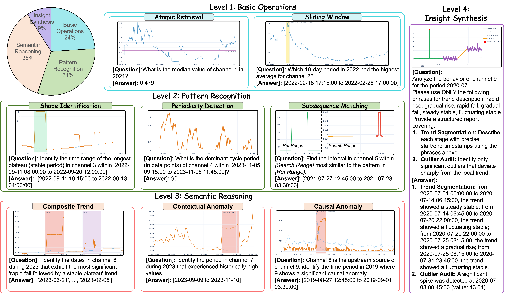
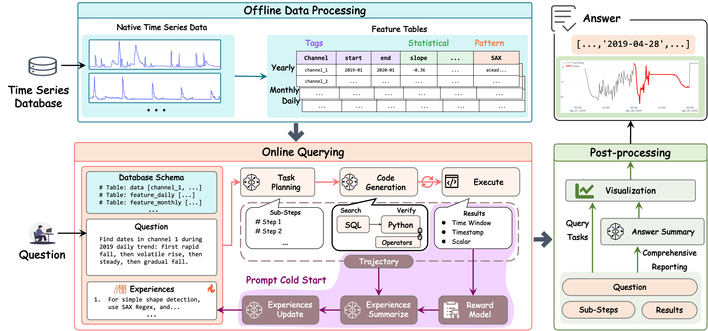
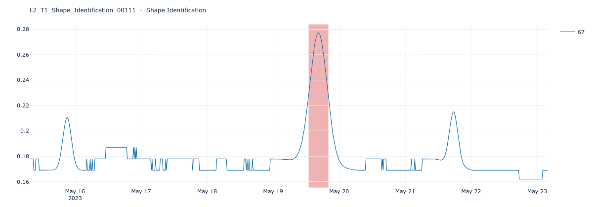
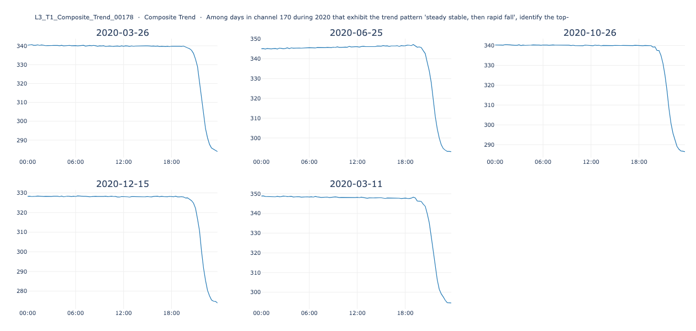

<h1 align="center">Sonar-TS: Search-Then-Verify Natural Language Querying for Time Series Databases</h1>

<p align="center">
  <a href="https://arxiv.org/abs/2602.17001"></a>
  <a href="https://icml.cc/Conferences/2026"></a>
  <a href="https://huggingface.co/spaces/mrtan/Sonar-TS-Demo"></a>
  <a href="https://huggingface.co/datasets/mrtan/NLQTSBench"></a>
  <a href="LICENSE"></a>
</p>

<p align="center">
  <b>Official implementation of the Sonar-TS paper (ICML 2026).</b>
</p>

## 📖 Introduction

Time-series data is everywhere in industry. Common examples include temperature readings, stock prices, and factory sensor logs. When a non-expert wants to extract specific information from such data, they often hit a serious wall. For instance, they might ask: *"In the past month, on which day did the temperature rise sharply between 10 a.m. and 3 p.m. and then drop just as quickly?"* Today, no existing method can directly answer this kind of natural-language question over a real time-series database.

Existing approaches fall short in two characteristic ways. Text-to-SQL methods are designed for relational data and cannot describe the shape-based morphology that defines time series (such as *plateau*, *rapid fall*, *fluctuating stable*). Time-series language models can answer questions over short windows, but they cannot scale to the database-scale histories that real applications need.

<p align="center">
  
</p>

This leaves a real, unsolved problem: an interface where users describe time-series patterns in natural language and have them answered against the underlying database. We close that gap with three contributions:

* **New problem.** We formally define the problem as **Natural Language Querying for Time Series Databases (NLQ4TSDB)**.
* **New benchmark.** We release **NLQTSBench**, the first benchmark for standardized evaluation of NLQ4TSDB.
* **Novel framework.** We propose **Sonar-TS**, a framework that solves NLQ4TSDB through a *Search-Then-Verify* pipeline.

## 🗂️ NLQTSBench

<p align="center">
  
</p>

**NLQTSBench** is the first standardized benchmark for NLQ4TSDB:

* **Size & Diversity:** Contains **1,153 tasks** spanning **4 difficulty levels** and **9 sub-tasks**.
* **Download:** Hosted on HuggingFace at [**mrtan/NLQTSBench**](https://huggingface.co/datasets/mrtan/NLQTSBench).

## 🔍 Sonar-TS Framework

<p align="center">
  
</p>

Sonar-TS is a three-stage pipeline:

1. **Offline data processing** builds multi-scale feature tables on top of the raw series.
2. **Online querying** runs an LLM through Task Planning, Code Generation, and Execute. Its Experiences (e.g., skills) come from the *Prompt Cold Start* loop ([`cold_start/`](cold_start/)).
3. **Post-processing** renders the verified result as a natural-language answer, with an optional visualization.

## 🚀 Quick start

### 1. Install dependencies

```bash
git clone https://github.com/Atlamtiz/Sonar-TS.git
cd Sonar-TS
conda create -n sonarts python=3.11 -y && conda activate sonarts
pip install -r requirements.txt
```

### 2. Download the benchmark data from HuggingFace

The raw CSVs (around 1.7 GB) live on HuggingFace. One command pulls them into the expected location:

```bash
python scripts/download_dataset.py
```

This places 1,153 CSVs under `nlqtsbench/ts_data/`. The benchmark spec (`nlqtsbench/tasks.json`) is already in this repository.

### 3. Configure your DeepSeek API key

The framework defaults to **DeepSeek** (`deepseek-v4-flash`) with **10 worker threads**, one dedicated API key per worker. With 10 keys, a full benchmark run takes about 25 minutes.

Copy the template and paste your keys:

```bash
cp -n configs/deepseek_api-key.txt.example configs/deepseek_api-key.txt
$EDITOR configs/deepseek_api-key.txt        # paste one key per line
```

If you have fewer than 10 keys, also lower `concurrency.workers` in `configs/online.yaml` to match.

### 4. Build per-task databases + features (one-shot, ~10 min)

```bash
python -m scripts.load_benchmark        # CSV → per-task database
python -m scripts.build_index           # SAX feature tables per task
```

> **Note:** For ease of reproduction, this release ships a lightweight **SQLite-based** implementation. The framework's data layer is backend-agnostic by design; production TSDBs (InfluxDB, TimescaleDB, etc.) can be supported by swapping the storage adapter.

### 5. Run the benchmark

```bash
python main.py
```

**Useful flags** (full list via `python main.py --help`):

| Flag            | Effect                                                                                                           |
| --------------- | ---------------------------------------------------------------------------------------------------------------- |
| `--limit N`   | Process only the first `N` tasks. Use for a quick smoke test before committing to the full ~25 min run.        |
| `--workers N` | Override the worker thread count (default: 10, from `configs/online.yaml`). Lower this if you have fewer keys. |
| `--figures`   | Also render one PNG per task (`output/figures/`). Adds ~15-20 min via a multi-process Kaleido pool.            |
| `--rebuild`   | Discard `output/predict_partial.jsonl` and re-run every task. Use after editing prompts, skills, or configs.   |
| `--out-dir `  | Write results to a custom directory instead of `./output/`.                                                    |

Results print to the terminal as a paper-aligned per-category / per-level / overall table, and are written to `./output/`:

```
output/
├── predict.json         submission-format predictions
├── summary.json         per-subtask / per-category / overall scores
└── per_task.json        one row per task with prediction + score
```


### 🎯 Example outputs

Visualizations produced by `python main.py --figures`. Curated samples live in [`output/figures/examples/`](output/figures/examples/); the corresponding score breakdown is in [`output/summary.json`](output/summary.json) and [`output/per_task.json`](output/per_task.json).

<p align="center">
  
  
</p>

<p align="center">
  <sub><b>Left:</b> Shape Identification. <b>Right:</b> Composite Trend.</sub>
</p>

## 📁 Project structure

```
Sonar-TS
├── main.py
├── requirements.txt
├── LICENSE
│
├── configs/
│ ├── online.yaml
│ ├── offline.yaml
│ ├── deepseek_api-key.txt.example
│ └── deepseek_api-key.txt (gitignored)
│
├── sonar_ts/
│ ├── pipeline.py
│ ├── planner.py
│ ├── generator.py
│ ├── executor.py
│ ├── evaluator.py
│ ├── llm.py
│ ├── schema.py
│ ├── storage.py
│ ├── offline.py
│ ├── prompts/
│ ├── postprocess/
│ └── skills/
│
├── scripts/
│ ├── download_dataset.py
│ ├── load_benchmark.py
│ ├── build_index.py
│ ├── run_benchmark.py
│ └── render_samples.py
│
├── cold_start/
│ ├── orchestrator.py
│ ├── run_cold_start.py
│ ├── download_train_data.py
│ ├── agents/
│ ├── train_data/
│ └── discovered_skills/
│
├── nlqtsbench/
│ ├── tasks.json
│ ├── predict_perfect.json
│ └── ts_data/ 
│
├── docs/figures/
│
├── databases/ 
└── output/
```

> See [`cold_start/README.md`](cold_start/README.md) and [`nlqtsbench/README.md`](nlqtsbench/README.md) for sub-system details.

## 📑 Citation

```bibtex
@misc{tan2026sonartssearchthenverifynaturallanguage,
      title={Sonar-TS: Search-Then-Verify Natural Language Querying for Time Series Databases}, 
      author={Zhao Tan and Yiji Zhao and Shiyu Wang and Chang Xu and Yuxuan Liang and Xiping Liu and Shirui Pan and Ming Jin},
      year={2026},
      eprint={2602.17001},
      archivePrefix={arXiv},
      primaryClass={cs.AI},
      url={https://arxiv.org/abs/2602.17001}, 
}
```

## 🏛️ Affiliations

<p align="center">
  


</p>

